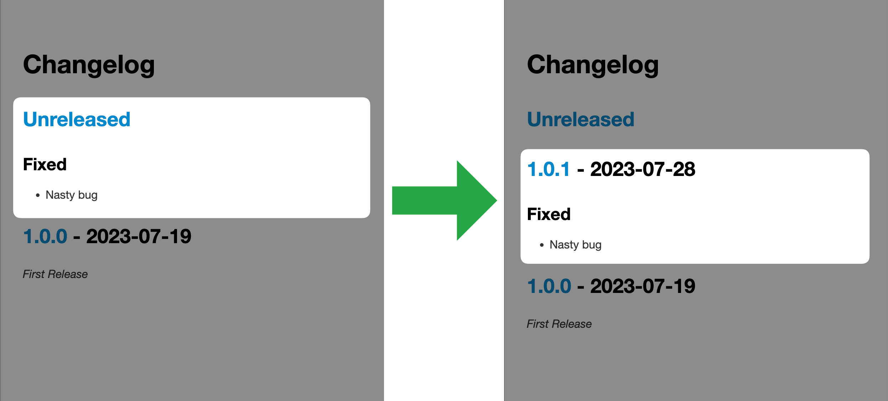

# changelog-version

[](https://github.com/anton-yurchenko/changelog-version/releases/latest)
[](https://codecov.io/gh/anton-yurchenko/changelog-version)
[](https://goreportcard.com/report/github.com/anton-yurchenko/changelog-version)
[](https://github.com/anton-yurchenko/changelog-version/actions/workflows/release.yml)
[](https://hub.docker.com/r/antonyurchenko/changelog-version)
[](LICENSE.md)

A **GitHub Action** for a new version creation in the **changelog file** using an **Unreleased section**.  

<p align="center"></p>

<details><summary>Demo</summary>


</details>

## Features

- Parse input to match [Semantic Versioning](https://semver.org/)
- [Keep a Changelog](https://keepachangelog.com/) Compliant
- Supports GitHub Enterprise
- Supports standard `v` prefix out of the box
- Automatically retries API operations

## Manual

1. Add changes to the **Unreleased** section in `CHANGELOG.md` file in your feature branch. *For example:*

    ```markdown
    ## [Unreleased]

    ### Added
    - Glob pattern support
    - Unit Tests
    - Log version
    
    ### Fixed
    - Exception on margins larger than context of changelog
    - Nil pointer exception in 'release' package
    
    ### Changed
    - Refactor JavaScript wrapper
    ```

2. Review the changes and merge Pull Request
3. Manually start a GitHub Actions Workflow providing a desired Semantic Version (**including `v` prefix**)
4. **Changelog-Release** will update the Changelog file, create Tags and push the changes :wink:  
    - [*optionally*] Trigger another workflow using the newly arrived Version Tag  
    - [*optionally*] Update other files within current workflow before `changelog-version` to commit changed files as well (useful when you need to update a version in one of the project files like `package.json`)

## Configuration

1. Change the workflow to be triggered manually with the required inputs:

    ```yaml
    on:
      workflow_dispatch:
        inputs:
          version:
            type: string
            description: "Semantic Version (X.X.X)"
            required: true
    ```

2. Add *Release* step to your workflow:

    ```yaml
        - name: Update Changelog
          uses: docker://antonyurchenko/changelog-version:v1
          env:
            GITHUB_TOKEN: ${{ secrets.GITHUB_TOKEN }}
            VERSION: ${{ github.event.inputs.version }}
            UPDATE_TAGS: "true"
    ```

3. Configure *Release* step:

    | Environmental Variable  | Allowed Values    | Default Value     | Description                                |
    |:-----------------------:|:-----------------:|:-----------------:|:------------------------------------------:|
    | `CHANGELOG_FILE`        | `*`               | `CHANGELOG.md`    | Changelog filename                         |
    | `UPDATE_TAGS`           | `true`/`false`    | `false`           | Update major and minor tags (`vX`, `vX.X`) |

## Remarks

- This action has multiple tags: `latest / v1 / v1.2 / v1.2.3`. You may lock to a certain version instead of using **latest**.  
(*Recommended to lock against a major version, for example* `v4`)
- Docker image is published both to [**Docker Hub**](https://hub.docker.com/r/antonyurchenko/changelog-version) and [**GitHub Packages**](https://github.com/anton-yurchenko/changelog-version/packages). If you don't want to rely on **Docker Hub** but still want to use the dockerized action, you may switch from `uses: docker://antonyurchenko/changelog-version:latest` to `uses: docker://ghcr.io/anton-yurchenko/changelog-version:latest`
- `changelog-version` may crash when executed against a not supported changelog file format. Make sure your changelog file is compliant to one of the supported formats.

## License

[MIT](LICENSE.md) © 2023-present Anton Yurchenko
